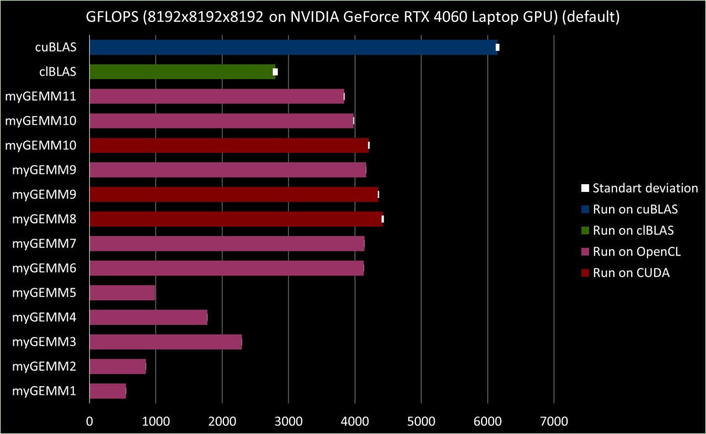
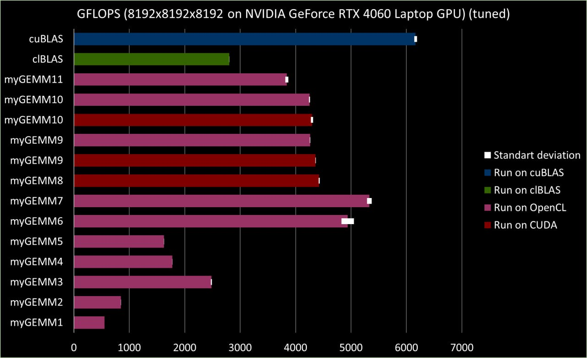
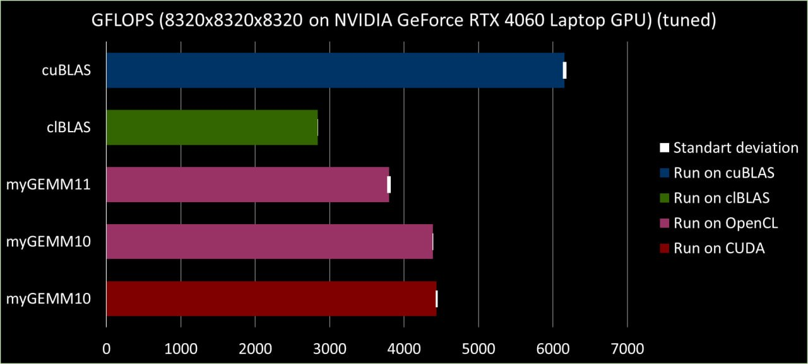

Exploring the performance of SGEMM in OpenCL on NVIDIA GPUs
=============

Date: 31-Oct-2014 - 07-Nov-2014

Author: Cedric Nugteren, SURFsara (http://www.surfsara.nl)

This repository contains multiple OpenCL implementations of single-precision generalised matrix-multiplication (SGEMM) tuned for an NVIDIA Tesla K40m GPU. The different versions (named myGEMM) are part of a step-by-step tutorial, in which each step adds a new optimisation. The different steps and the details of the OpenCL kernel codes are all explained in depth at http://www.cedricnugteren.nl/tutorial.php.

The OpenCL kernels can be used natively using the OpenCL framework. However, there is also a header-file included which converts the OpenCL kernels into CUDA syntax. This allows the same code to be tested through the CUDA-toolchain.

Apart from the OpenCL kernel codes, this repository contains fully working host code, including a loop over different matrix sizes and different BLAS libraries. It contains code to run NVIDIA's cuBLAS as a reference and the open-source clBlas library.

Pre-requisites:
* A C++ compiler (tested with GCC and ICC)
* The CUDA toolkit and NVCC compiler (tested with version 6.5)
* OpenCL headers and libraries (part of the CUDA toolkit)

Requirements to run the performance and correctness comparisons:
* The cuBLAS library (part of the CUDA toolkit, tested version 6.5)
* The open-source clBlas library (tested 2.2.0)

Usage
=============

*	Compile the code:

		make build

	Compiles the benchmarking infrastructure and the myGEMM kernels. Make sure there is a "bin" and "obj" directory available. Note that you might have to edit the Makefile to set the proper locations of the CUDA and OpenCL installations on your system.

*	Run the code:

		make run

	This runs the code for matrices ranging from MINSIZE to MAXSIZE (defined in src/common.h). It will run cuBLAS, clBlas, and the CUDA and OpenCL versions of the myGEMM kernels. The particular kernel to be executed is defined using the KERNEL keyword in src/settings.h. This file also contains other settings you might want to modify for your particular GPU.

*	Inspect the code:

		make inspect

	This generates all kinds of assembly-like versions of the CUDA kernels in the "bin" subdirectory. It also prints out statistics of the kernels such as the register usage.

Minimal working example
=============

Additionally, we supply the minimal.cpp file in the 'extra' directory. This file is a self-contained minimal working example (MWE) of the most basic SGEMM kernel (myGEMM1). This can be useful if you don't want to deal with Makefiles or don't have the CUDA, cuBLAS, or clBlas installed. Note that minimal.cpp misses some features compared to the main code, but we believe that it can nevertheless be a good starting point if you want to integrate myGEMM into your own code.

The code can be compiled using a regular C++ compiler and only requires OpenCL installed. Example compilation from the root folder:

	g++ -O3 -Wall -I/path/to/opencl/include extra/minimal.cpp -o bin/minimal -lOpenCL

Be aware that the minimal working example does not:
*	Iterate over multiple matrix sizes
*	Compare performance with cuBLAS or clBlas
*	Check for correctness of the results
*	Check for OpenCL errors
*	Load a kernel-file from disk, instead it is embedded as a string

###################################################

# GEMM Optimization Experiments

This repository is based on the OpenCL SGEMM tuning tutorial by Cedric Nugteren:
https://cnugteren.github.io/tutorial/pages/page1.html

The goal of this work is to **study the step-by-step optimization of single-precision matrix multiplication (SGEMM) on a GPU**, and to conduct experiments evaluating how different optimization techniques affect performance.

---

## Experimental Setup

### Hardware

- **CPU:** AMD Ryzen 7 7435HS (8 cores / 16 threads)
- **RAM:** 16 GB
- **GPU:** NVIDIA GeForce RTX 4060 Laptop GPU
  - GPU Memory: 8 GB
  - Compute Capability: 8.9

### Software

- **OS:** Manjaro Linux
- **GPU Driver:** 590.48.01
- **CUDA Toolkit:** 13.1
- **NVCC Compiler:** 13.1.115
- **OpenCL Platform:** OpenCL 3.0
- **Compiler:** GCC 15.2.1
- **Compiler flags:** -O3 -arch=sm_89 -Xcompiler -Wall

### Libraries

- CUDA
- OpenCL 
- cuBLAS
- clBLAS

---

## Benchmark Configuration and Measurement Methodology

To obtain statistically reliable measurements of SGEMM performance, the following procedure was used:

- **Matrix sizes tested:** `8192x8192x8192`, `8320x8320x8320`
- **Kernel executions:** Each kernel was executed **40 times per matrix size** to ensure stable statistics
- **Warm-up runs:** A few preliminary runs were performed before measurements to stabilize GPU performance
- **Pauses between runs:** Introduced to reduce thermal throttling and other system effects
- **Performance metric:** GFLOPS (Giga Floating Point Operations per Second)
- **Measured statistics:**
  - Mean GFLOPS
  - Standard deviation (std)
  - 95% confidence interval (CI95)
  - p-values from D'Agostino and Shapiro tests for normality

---

## SGEMM Optimization Steps

The tutorial progressively optimizes the SGEMM kernel. Each kernel corresponds to a specific optimization step:

| Kernel | Optimization                                  |
|--------|-----------------------------------------------|
| 1      | Naive implementation                          |
| 2      | Tiling in the local memory                    |
| 3      | More work per thread                          |
| 4      | Wider data-types                              |
| 5      | Transposed input matrix and rectangular tiles |
| 6      | 2D register blocking                          |
| 7      | Wider loads with register blocking            |
| 8      | CUDA and Kepler-specific optimizations        |
| 9      | Pre-fetching                                  |
| 10     | Incomplete tiles and arbitrary matrix sizes   |
| 11     | Evaluation of the clBLAS SGEMM kernel         |

---

## Default vs Tuned Configuration

Two experiment scripts were used to collect performance data:

### `run_experiments_default.py` (Default)

Uses default parameters from `src/settings.h` for each kernel:

| Parameter                              | Default |
|----------------------------------------|---------|
| TS (tile-size)                         | 32      |
| WPT (work-per-thread)                  | 8       |
| WIDTH (vector-width)                   | 4       |
| TSDK (tile-size K (for kernel 5 only)) | 16      |
| TSM / TSN (tile-size M/N)              | 128     |
| TSK (tile-size K)                      | 16      |
| WPTM / WPTN (work-per-thread M/N)      | 8       |

### `run_experiments_tuned.py` (Tuned)

Iterates over a grid of valid parameter combinations for each kernel. After that the best-performing configuration per kernel is calculated in `calculate_results_tuned.py` and selected as the "tuned" result:

| Kernel     | Tuned parameters                                      |
|------------|-------------------------------------------------------|
| 1          | (default)                                             |
| 2          | (default)                                             |
| 3          | WPT = 16                                              |
| 4          | (default)                                             |
| 5          | TS = 64, WPT = 16                                     |
| 6          | TSK = 32                                              |
| 7          | WIDTH = 2                                             |
| 8          | TSM = 64, TSN = 64, TSK = 8                           |
| 9 (CUDA)   | (default)                                             |
| 9 (OpenCL) | WIDTH = 2                                             |
| 10         | TSM = 160, TSN = 160, WPTM = 10, WPTN = 10, WIDTH = 2 |
| 11         | (default)                                             |

---

## Performance Tables

### Matrix Size: 8192x8192x8192 (Default)

| Implementation | Mean GFLOPS | Std GFLOPS | 95% CI | Dagostino p | Shapiro p |
| -------------- | ----------- | ---------- | ------ | ----------- | --------- |
| cuBLAS         |        6148 |      28.66 |      9 |     0.06213 |   0.00738 |
| clBLAS         |        2800 |      36.67 |     12 |     0.00000 |   0.00000 |
| myGEMM1 (cl)   |         550 |       2.81 |    0.9 |     0.28766 |   0.05748 |
| myGEMM2 (cl)   |      848.97 |       1.83 |    0.6 |     0.21732 |   0.00166 |
| myGEMM3 (cl)   |      2295.2 |       1.86 |    0.6 |     0.01592 |   0.04850 |
| myGEMM4 (cl)   |      1774.7 |       2.48 |    0.7 |     0.00002 |   0.00000 |
| myGEMM5 (cl)   |       985.5 |       1.58 |    0.5 |     0.13439 |   0.03557 |
| myGEMM6 (cl)   |        4132 |       3.04 |      1 |     0.53988 |   0.28751 |
| myGEMM7 (cl)   |      4143.3 |       2.21 |    0.7 |     0.29212 |   0.31761 |
| myGEMM8 (cu)   |        4418 |      16.67 |      5 |     0.00000 |   0.00000 |
| myGEMM9 (cu)   |        4355 |       9.52 |      3 |     0.00000 |   0.00000 |
| myGEMM9 (cl)   |        4170 |       3.64 |    1.2 |     0.90889 |   0.48672 |
| myGEMM10 (cu)  |        4210 |      13.56 |      4 |     0.01270 |   0.00002 |
| myGEMM10 (cl)  |        3982 |       6.87 |      2 |     0.00079 |   0.00000 |
| myGEMM11 (cl)  |        3839 |       7.36 |      2 |     0.00000 |   0.00000 |

---

### Matrix Size: 8192x8192x8192 (Tuned)

| Implementation | Mean GFLOPS | Std GFLOPS | 95% CI | Dagostino p | Shapiro p |
| -------------- | ----------- | ---------- | ------ | ----------- | --------- |
| cuBLAS         |        6165 |      23.89 |      8 |     0.15048 |   0.01809 |
| clBLAS         |        2805 |       3.11 |      1 |     0.77702 |   0.05952 |
| myGEMM1 (cl)   |       551.4 |       1.66 |    0.5 |     0.30525 |   0.06726 |
| myGEMM2 (cl)   |       849.6 |       2.32 |    0.8 |     0.21732 |   0.00166 |
| myGEMM3 (cl)   |        2481 |      12.52 |      4 |     0.00475 |   0.02971 |
| myGEMM4 (cl)   |      1777.2 |       2.48 |    0.8 |     0.00000 |   0.00000 |
| myGEMM5 (cl)   |        1627 |       4.17 |      3 |     0.69643 |   0.70834 |
| myGEMM6 (cl)   |        4940 |     112.82 |     80 |     0.07274 |   0.02124 |
| myGEMM7 (cl)   |        5330 |      43.56 |     30 |     0.65197 |   0.69888 |
| myGEMM8 (cu)   |        4425 |       8.70 |      3 |     0.01115 |   0.00427 |
| myGEMM9 (cu)   |        4360 |       5.31 |    1.7 |     0.21460 |   0.21540 |
| myGEMM9 (cl)   |        4262 |       4.17 |    1.4 |     0.44794 |   0.46157 |
| myGEMM10 (cu)  |        4297 |      19.19 |      6 |     0.00074 |   0.00000 |
| myGEMM10 (cl)  |        4252 |       9.37 |      3 |     0.00000 |   0.00000 |
| myGEMM11 (cl)  |        3842 |      28.54 |      9 |     0.00000 |   0.00000 |

---

### Matrix Size: 8320x8320x8320 (Default)

| Implementation | Mean GFLOPS | Std GFLOPS | 95% CI | Dagostino p | Shapiro p |
| -------------- | ----------- | ---------- | ------ | ----------- | --------- |
| cuBLAS         |        6150 |      22.36 |      7 |     0.49800 |   0.11407 |
| clBLAS         |        2840 |      36.71 |     12 |     0.00000 |   0.00000 |
| myGEMM10 (cu)  |        4212 |       9.94 |      3 |     0.04064 |   0.00005 |
| myGEMM10 (cl)  |        3990 |       4.32 |    1.4 |     0.00000 |   0.00000 |
| myGEMM11 (cl)  |        3795 |      26.67 |      9 |     0.00000 |   0.00000 |

---

### Matrix Size: 8320x8320x8320 (Tuned)

| Implementation | Mean GFLOPS | Std GFLOPS | 95% CI | Dagostino p | Shapiro p |
| -------------- | ----------- | ---------- | ------ | ----------- | --------- |
| cuBLAS         |        6155 |      24.86 |      8 |     0.22382 |   0.03739 |
| clBLAS         |      2840.9 |       2.81 |    0.9 |     0.69941 |   0.47770 |
| myGEMM10 (cu)  |        4435 |      13.57 |      4 |     0.00000 |   0.00000 |
| myGEMM10 (cl)  |        4385 |       5.11 |    1.7 |     0.10626 |   0.00271 |
| myGEMM11 (cl)  |        3797 |      25.31 |      8 |     0.00000 |   0.00000 |

---

The impact of tuning varies by kernel. Kernels that received the most profit:

- **Kernel 5** (~+65%): larger tile-size (TS = 64) and more work per thread (WPT = 16)
- **Kernel 6** (~+20%): larger tile-size in dimension K (TSK = 32)
- **Kernel 7** (~+29%): smaller vector-width (WIDTH = 2)

Other kernels showed little to no change, their default parameters were already near-optimal or optimal for the RTX 4060.

---

## Charts

Charts of GFLOPS performance for both default and tuned kernel configurations are available in the `charts/` folder:

 

 

---

## Notes

- Each kernel was executed with all other applications closed, laptop in **performance mode** and continuously **plugged in**, to reduce interference
- Multiple runs ensure statistical stability and allow computation of meaningful standard deviations and confidence intervals
- Some implementations did not pass normality tests. To investigate this issue, GPU frequency, temperature, power and memory consumption were monitored, but none of these metrics explained the observed non-normality. Nevertheless, the performance differences between kernels remain clearly separated, so the presence of outliers does not affect the results
